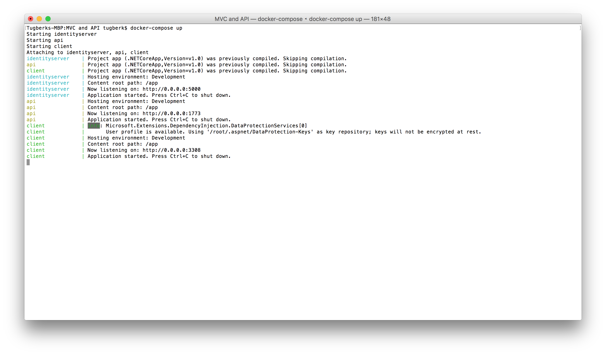

# ASP.NET MVC Core Application Calling an HTTP API Sample

## Running the solution

Getting the project up and running on your machine should be fairly straight forward after you have the necessary tools listed below:

 - `docker`: Installation guide is [here](https://docs.docker.com/engine/installation/). Currently used version is 1.10.2.
 - `docker-compose`: Installation guide is [here](https://docs.docker.com/compose/install/). Currently used version is 1.6.0.

These should be all you need. After getting these, `cd` into this folder and run `docker-compose up` on your terminal. You should see the output smilar to this:

From this point on, you can visit `http://localhost:3308/` on your browser to follow the example.

For questions and feedback - contact @tugberkugurlu
