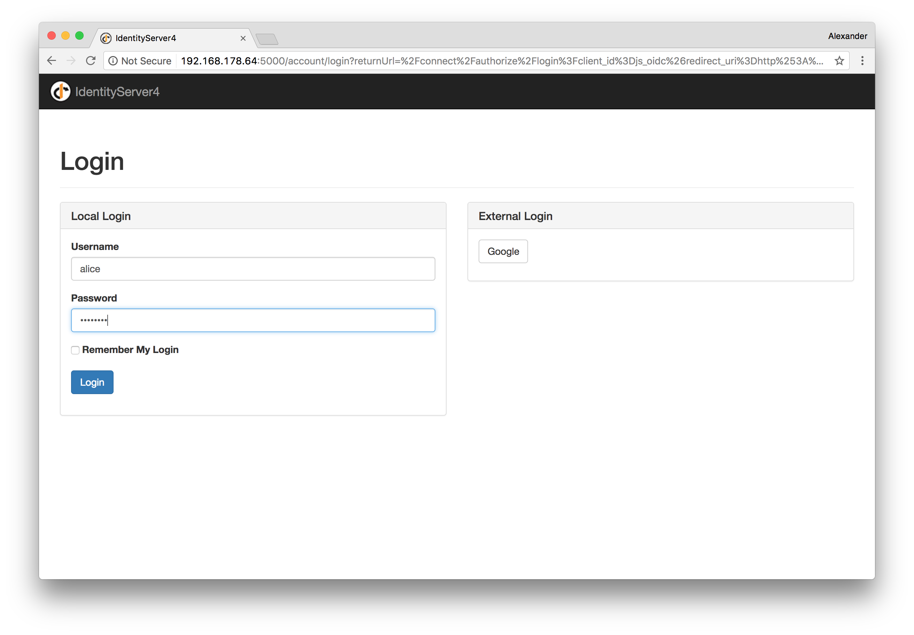
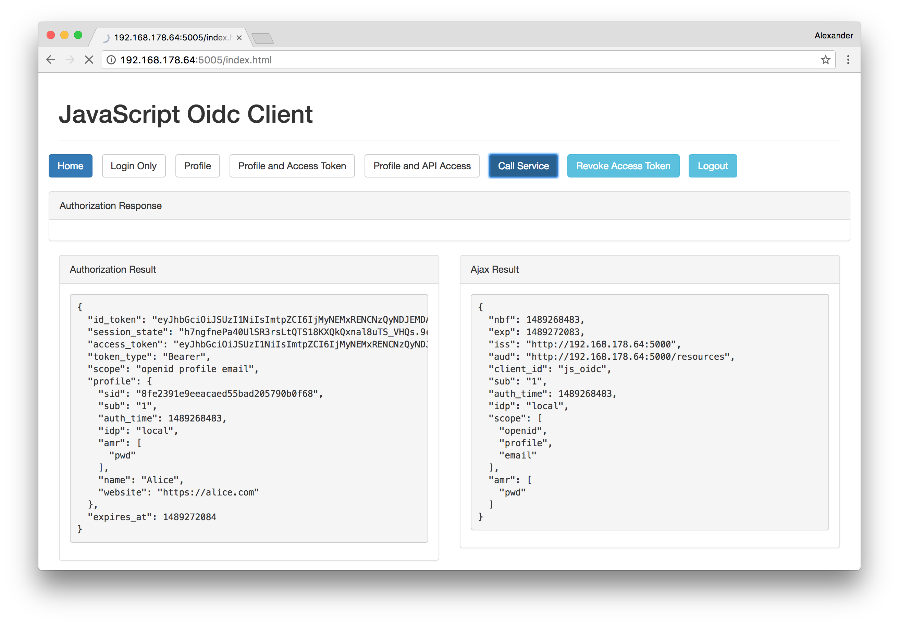

# IdentityServer4, OIDC JavaScript Client and Node.js API

## Usage

1. Create a signing certificate by running `create_signing_cert.sh`. Make sure leave the "Export Password" empty.    
2. Make sure `node src/tools/ip.js` only returns a single IP address.
3. Run `start.sh`
4. Open `http://<ipaddress>:5005` in your browser and click the "Profile and Access Token" Button:

5. Click the "Call Service" button

+The password for the users `alice` and `bob` is: `password`.    
+You can add additional or change existing users/passwords in `/NodeJsApi/src/QuickstartIdentityServer/Config.cs`.

For questions and feedback - contact @AlexZeitler
